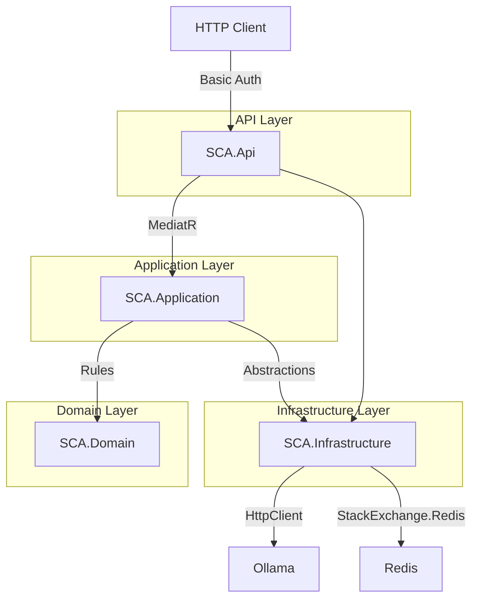
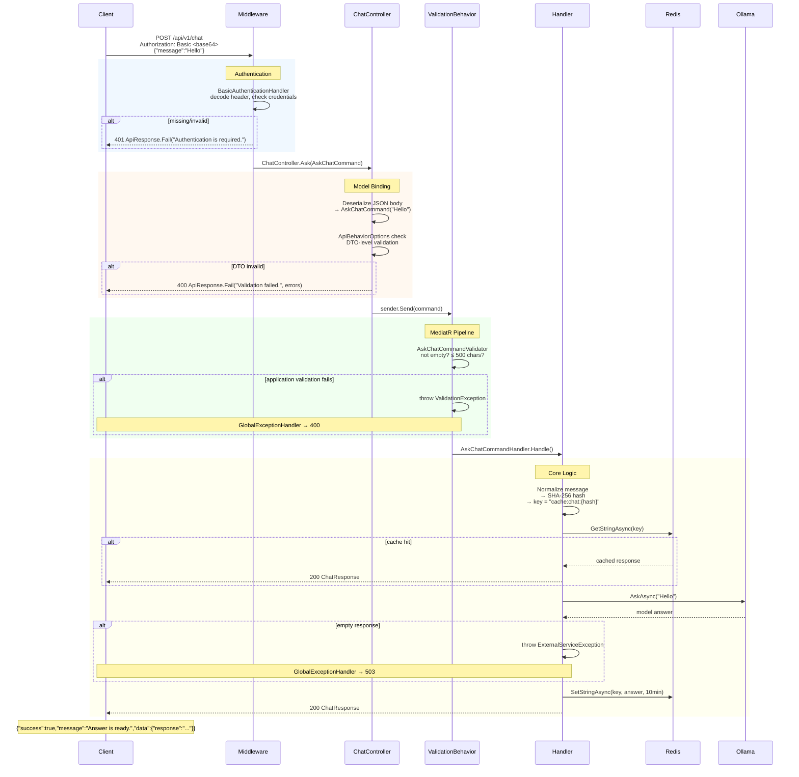

# Architecture

## Layer Diagram



`SCA.Api` references both `SCA.Application` (handler contracts) and `SCA.Infrastructure` (health check types for DI registration).

## Request Flow — Step by Step



## Layer Dependencies

| Layer       | Depends on                 | Contains |
|------------|----------------------------|----------|
| `SCA.Api` | Application, Infrastructure | Controllers, Auth, ApiResponse, Extensions, Program.cs |
| `SCA.Application` | Domain | CQRS handlers, ValidationBehavior, IOllamaClient, IRedisCache |
| `SCA.Domain` | (none) | ChatRules |
| `SCA.Infrastructure` | Application | RedisCache, OllamaClient, HealthChecks, Options |
| `SCA.IntegrationTests` | Api | CustomWebApplicationFactory, Fakes, Endpoint tests |

## Feature Folder Convention

```
SCA.Application/Features/Chat/AskChat/
  AskChatCommand.cs         # Command (also request DTO)
  AskChatCommandHandler.cs  # Handler (cache → ollama → cache)
  AskChatCommandValidator.cs# FluentValidation rules
  ChatResponse.cs           # Return DTO
```

Same feature is exposed in the API layer:

```
SCA.Api/Controllers/
  ChatController.cs   # POST /api/v1/chat → sends command
  HealthController.cs # GET /api/v1/health
  OllamaController.cs # GET /api/v1/ollama/status
```

## Key Files Reference

| File | Lines | Responsibility |
|---|---|---|
| `Api/Program.cs` | 55 | Startup, health check gate, Serilog bootstrap |
| `Api/Common/Responses/ApiResponse.cs` | 22 | Unified `{ success, message, data }` model |
| `Api/Common/Controllers/ApiControllerBase.cs` | 24 | Route prefix, Ok helpers |
| `Api/Authentication/BasicAuthenticationHandler.cs` | 93 | Basic auth with ApiResponse on fail |
| `Api/Extensions/ServiceCollectionExtensions.cs` | 74 | DI: auth, controllers, validation, health checks |
| `Api/Extensions/ApplicationBuilderExtensions.cs` | 65 | Middleware: logging, exception handler, auth |
| `Api/Extensions/WebApplicationBuilderExtensions.cs` | 37 | Serilog + layer registration chain |
| `Application/DependencyInjection.cs` | 24 | MediatR, validators, pipeline |
| `Application/Behaviors/ValidationBehavior.cs` | 35 | FluentValidation pipeline behavior |
| `Application/Features/Chat/AskChat/AskChatCommandHandler.cs` | 59 | Core logic: cache → ollama → cache |
| `Application/Features/Chat/AskChat/AskChatCommandValidator.cs` | 21 | Not empty, max 500 chars |
| `Application/Common/ExternalServiceException.cs` | 6 | Custom exception → 503 |
| `Domain/ChatRules.cs` | 17 | MessageMaxLength, CacheDuration |
| `Infrastructure/Cache/RedisCache.cs` | 31 | IDistributedCache wrapper |
| `Infrastructure/Ollama/OllamaClient.cs` | 86 | HttpClient → POST /api/chat |
| `Infrastructure/HealthChecks/RedisHealthCheck.cs` | 20 | Startup gate: Redis ping |
| `Infrastructure/HealthChecks/OllamaHealthCheck.cs` | 21 | Startup gate: model existence |
| `tests/SCA.IntegrationTests/CustomWebApplicationFactory.cs` | 42 | Test host with fakes |
| `tests/SCA.IntegrationTests/Features/Chat/ChatEndpointTests.cs` | 110 | 5 integration tests |
